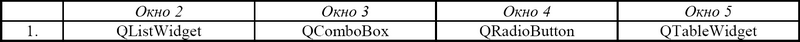
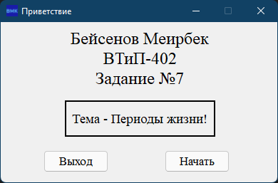
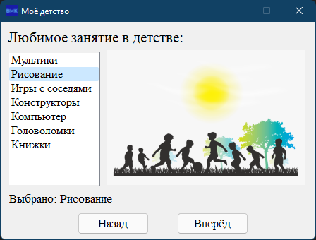
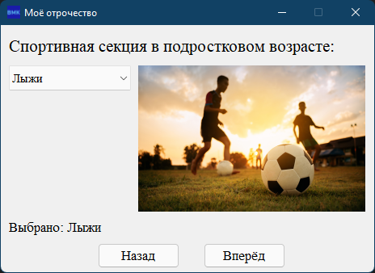
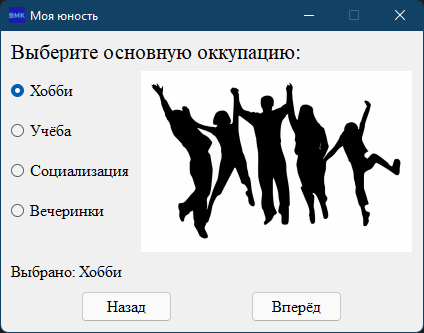
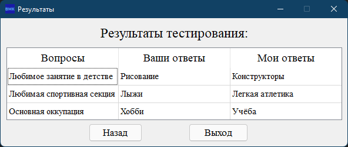

# BMK01_PyQt6_MultiForms

## Современное кроссплатформенное программирование

### Практическая работа №7. Многооконная программа с компонентами выбора и списками на PyQt6

### Вариант №1

## Окна программы
### Приветствие

### Детство (QListWidget)

### Отрочество (QComboBox)

### Юность (QRadioButton)

### Результаты (QTableWidget)

